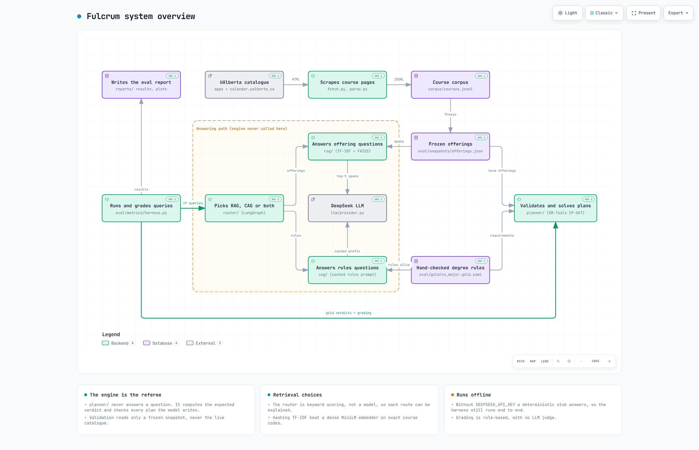
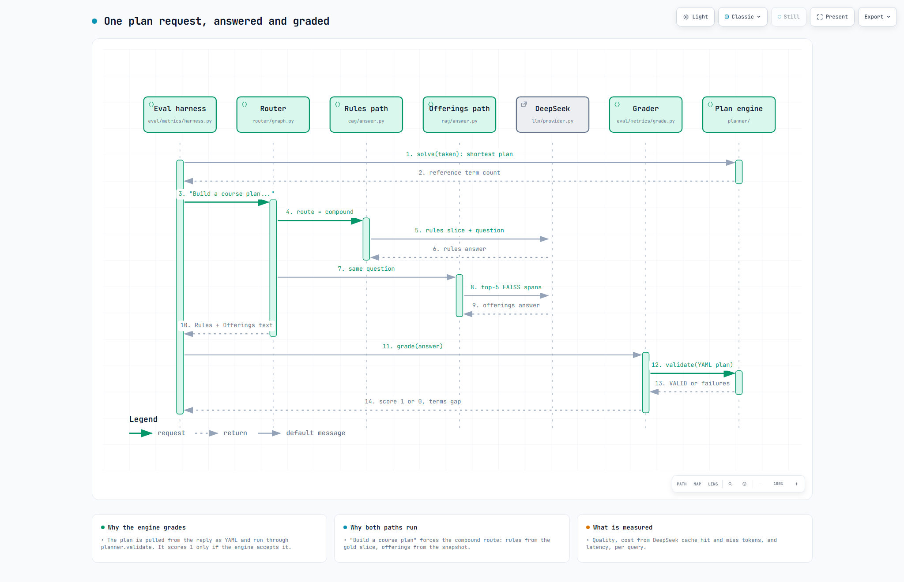
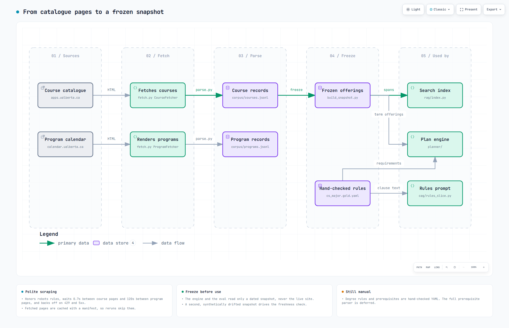

# Fulcrum

Fulcrum answers questions about University of Alberta degree requirements and
checks degree plans against them. It covers the Computing Science major today,
and is built to extend to the rest of the programs in the catalogue.

It has two parts. The first is retrieval. A RAG and CAG setup answers questions
about course offerings and program rules, and an evaluation harness scores the
answers on quality, cost, and latency against a gold answer key. The second part
is a constraint engine that validates degree plans and solves for a shortest one.
The engine is not the headline. It is the thing the evaluation grades against, so
that a question like "is this plan valid" has a real answer instead of whatever
the model happens to say.

The scope right now is the CS Major for the 2026-2027 catalog year.

## How it fits together

All the scraper does is plain extraction. It reads course and program
pages and writes structured JSONL. Requirement text such as prerequisites is kept
exactly as it appears on the page. There is no prerequisite logic in the scraper.

On top of the data sit four pieces:

- the constraint engine in `planner/`, which validates a plan and can solve for a
  shortest one using CP-SAT
- the RAG path in `rag/`, which retrieves course and offering text and answers
  offering questions
- the CAG path in `cag/`, which answers rules questions from a stable slice of the
  gold requirements and cites the clause it used
- a router in `router/` that reads a question and sends it to RAG, CAG, or both

The evaluation harness in `eval/` runs all three configurations over a fixed query
set, grades each answer with the engine and the snapshot as the source of truth,
and writes a report.

```
fetch.py parse.py parsers.py daycodes.py schema.py   scraper
corpus/      scraped courses and programs (JSONL)
planner/     constraint engine (validate + solve)
llm/         provider abstraction (DeepSeek, plus an offline stub)
rag/ cag/    the two retrieval paths
router/      query classifier and graph
eval/        gold key, queries, snapshots, and the metrics harness
reports/     generated results and plots
```

## How it works

A router sends each question to a RAG path for course offerings or a CAG path for degree rules, and a constraint engine grades every answer against a frozen snapshot and a hand-checked rule set.


The scraper feeds a frozen snapshot. The router, RAG and CAG answer questions with DeepSeek. The engine in `planner/` only computes expected verdicts and grades.


A "build me a plan" question takes both paths. The plan in the reply is pulled out as YAML, and `planner.validate` decides whether it scores.


Course pages come over httpx and program pages through Playwright. Both are parsed to JSONL, then frozen into a dated snapshot that the index and the engine read.

Interactive versions with pan, zoom and theme switch: `docs/diagrams/overview.html`, `docs/diagrams/main-flow.html`, `docs/diagrams/pipeline.html`


## Running it

Most things go through the Makefile.

```
make test       run the test suite
make eval       run the evaluation harness
make validate PLAN=eval/plans/valid_174_stream.plan.yaml
make solve TAKEN='CMPUT 174,MATH 125'
```

The evaluation uses DeepSeek. If you put a `DEEPSEEK_API_KEY` in a `.env` file it
runs against the real model. If you do not, it falls back to an offline stub so the
harness still runs from end to end, though the numbers are only illustrative.
Reports regenerate from the saved results with no API calls.

## Results

These are from a real run against DeepSeek over the gold query set.

| Configuration | Quality | Prereq | Plan validity | Cost | p50 latency |
|---|---|---|---|---|---|
| RAG only | 0.649 | 0.91 | 0.43 | $0.0016 | 1.01s |
| CAG only | 0.447 | 1.00 | 0.71 | $0.0042 | 1.22s |
| Routed | 0.723 | 1.00 | 0.71 | $0.0043 | 1.11s |

The two baselines are good at different things. RAG handles offering questions,
which are about live data. CAG handles rules questions, which are about fixed
requirements. The router picks the better of the two for each question, so the
routed setup ends up ahead of either one on its own.

One result worth calling out is that the model is poor at producing a valid plan
on its own. It writes plans that the engine then rejects, usually because a course
is scheduled in a term it is not offered in, or a credit exclusion is broken. That
is the case for the constraint engine in one line. The engine is the planner, not
the model.

A side note on retrieval: the default embedder is a plain TF-IDF hashing vector,
not a dense model. On a corpus full of exact course codes the lexical version
actually scored higher than sentence-transformers, because the dense model blurs
codes like CMPUT 174 and CMPUT 229 together. The dense path is still there behind a
flag if you want to compare.

## Limitations

This is a scoped demonstration, not a production degree planner. A few things to be
aware of:

- Prerequisites outside the program (for example the math chain behind some stats
  courses) are not enforced, so feasibility along those paths is only partial.
- Graded plans draw from a fixed set of 31 courses, the named core plus a small set
  of hand checked electives, not the whole catalogue.
- The evaluation indexes only three subjects (CMPUT, MATH, STAT) by default, since
  the gold query set covers CS-degree questions where those are the relevant
  departments. The retriever builds over whatever subjects it is given, so the
  other scraped subjects can be included by widening that setting, but the shipped
  eval numbers reflect the three-subject index.
- The freshness check is demonstrated against a synthetically perturbed snapshot,
  because the catalogue is stable between scrapes over short spans. A real second
  snapshot will come from a re-scrape at the Fall 2026 registration window, when
  seats and sections actually move.
- The full prerequisite parser is deferred. The engine currently relies on a small
  set of hand verified prerequisite entries instead.

## Notes

Python 3.14 locally, though the Dockerfile uses 3.12. The scraper needs Playwright
for the program pages, since those sit behind a browser challenge. Course pages are
plain HTML and need only an HTTP client.
